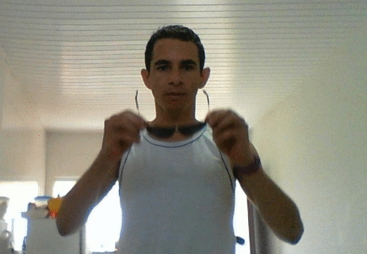

# Treinando meu próprio cascade
Arquivos cascade para detecção de faces, olhos são bastante conhecidos, mais às vezes precisamos detectar outros objetos, se esse for o caso provavelmente tera que criar seu próprio arquivo. Nesse exemplo trainamos um cascade para detectar um óculo de sol. Você pode usar sua webcam para capturar dados necessários.

## baixando esse repositório

`git clone https://github.com/eltonfernando/haar_train.git`

Entre na pasta haar_train, onde vamos trabalhar.


## Dependências:
- [Python 3.x](https://www.python.org/)
- [opencv-python](https://pypi.org/project/opencv-python/)

`sudo apt-get install python3-dev python3-pip libopencv-dev`

`pip3 install opencv-python`
```
sudo apt-get install build-essential

sudo apt-get install cmake git libgtk2.0-dev pkg-config libavcodec-dev libavformat-dev libswscale-dev

sudo apt-get install python-dev python-numpy libtbb2 libtbb-dev libjpeg-dev libpng-dev libtiff-dev libjasper-dev libdc1394-22-dev

sudo apt-get install libopencv-dev

```
##Baixando versão do opencv com suporte para treinar haar cascade

``wget -O opencv.zip https://github.com/Itseez/opencv/archive/3.4.5.zip && unzip -qq opencv.zip``
``wget -O opencv_contrib.zip https://github.com/Itseez/opencv_contrib/archive/3.4.5.zip && unzip -qq opencv_contrib.zip``
```
mkdir build
cd build
mkdir binary
```
```
cmake -D CMAKE_CXX_FLAGS=-std=c++11 \
-D CMAKE_BUILD_TYPE=RELEASE \
-D CMAKE_C_COMPILER=/usr/bin/gcc-9 \
-D CMAKE_INSTALL_PREFIX=./binary \
-D BUILD_SHARED_LIBS=OFF \
-D BUILD_opencv_apps=ON \
-D OPENCV_ENABLE_NONFREE:BOOL=ON \
-D INSTALL_PYTHON_EXAMPLES=OFF \
-D BUILD_opencv_python2=OFF \
-D BUILD_opencv_python3=OFF \
-D INSTALL_C_EXAMPLES=OFF \
-D BUILD_TESTS=OFF \
-D BUILD_opencv_cudacodec=OFF \
-D BUILD_EXAMPLES=OFF \
-D MAKE_BUILD_TYPE=Debug \
-D BUILD_opencv_stereo=OFF \
-D BUILD_opencv_bioinspired=OFF \
-D BUILD_opencv_fuzzy=OFF \
-D BUILD_java=OFF \
-D OPENCV_EXTRA_MODULES_PATH=./../../opencv_contrib-3.4.5/modules ..
```
compilando
```
make -j4

make install
```
os executavél estão na pasta build/binary que criamos


Vamos precisar de algumas imagens:
* Um vídeo (ou conjunto de imagens) que contém o objeto que você queira detectar.
* Um vídeo (ou conjunto de imagens) sem o objeto.
A partir desses vídeos vamos extrair os frames e criar nossas imagens positivas e negativas.
Nas pastas negativas e positivas estão as imagens que utilizei.


## Construindo o projeto

Precisamos realizar algumas tarefas:
- (1) criar um arquivo bg.txt com o caminho para todas  as imagens negativas.
- (2) criar um arquivo info.txt contendo o caminho e as coordenado no objeto nas imagens positivas.
- (3) Criar um arquivo .vec a partir das imagens positivas.
 


veja como criei o arquivo bg.txt usando o script [gerar_lista_img_negativas.py](gerar_lista_img_negativas.py)

O arquivo info.txt além do caminho temos que anotar as localizações do objeto na imagem, para isso usamos a ferramenta opencv_annotation 

Para iniciar a ferramenta de anotação rode no terminal, passando o arquivo info.txt e a pasta com as imagens positivas:

`opencv_annotation -a=info.txt -i=positivas/`

obs: info.txt é o arquivo de anotação, ele deve estar em branco e a ferramenta não cria caso ele não exista

Com um click você marca o ponto superior esquerdo do retângulo, arraste para desenhar e finaliza com segundo click. Após cada seleção, você tem as seguintes opções:



* Pressionando c: confirme a anotação, (o retângulo deve ficar verde).

* Pressionar d: exclua a última anotação.

* Pressionando n: próxima imagem.

* Pressionando ESC: fecha janela

Com isso teremos o arquivo necessário para passar para o parâmetro -info de opencv_createsamples.

## Criando arquivo positives.vec

veja o script python [Prepara_train.py](Prepara_train.py)

Argumentos da linha de comando:

* `-vec positives.vec`: Nome do arquivo de saída que contém as amostras positivas para treinamento.

* `-bg bg.txt`: Uma lista com caminho das imagens negativas.

* `-num numPos`: Número de amostras positivas a serem geradas.

* `-w <Largura>`: Largura (em pixels) das amostras de saída.

* `-h <altura>`: Altura (em pixels) das amostras de saída.

# Treinamento

Para executar o treinamento, usaremos algumas variáveis definidas aqui, por isso coloquei tudo no mesmo arquivo [Prepara_train.py](Prepara_train.py) O comando opencv_traincascade espera os seguinter argumentos:

* `-data data`: Pasta para salvar o classificador treinado.

* `-vec positives.vec`: arquivo vec com amostras positivas (criadas pelo utilitário opencv_createsamples).

* `-bg bg.txt`: lista com link para as imagem negativas.
* `-numPos numPos`: Número de amostras positivas.

* `-numNeg numNeg`: número de amostras negativas.

* `-numStages numStages`: Número de estágios em cascata a serem treinados.

* `-precalcValBufSize <precalculated_vals_buffer_size_in_Mb>`: tamanho do buffer para valores de recursos pré-calculados (em Mb). Quanto mais memória você atribuir, mais rápido será o processo de treinamento, no entanto, lembre-se de que `-precalcValBufSize` e 
`-precalcIdxBufSize` combinados não devem exceder a memória do sistema disponível.

* `-precalcIdxBufSize <precalculated_idxs_buffer_size_in_Mb>`: tamanho do buffer para índices de recursos pré-calculados (em Mb). Quanto mais memória você atribuir, mais rápido será o processo de treinamento, no entanto, lembre-se de que -precalcValBufSize e -precalcIdxBufSize combinados não devem exceder a memória do sistema disponível.


